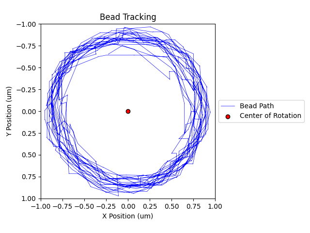

# MyOne Dynabead Research
This is starting as a quick and dirty script I threw together to try and replace an $800/year Mathematica subscription we need for current tracking processes. I might try to build in auto-cropping and filtering at some point once I have more examples to work off. Right now the script just processes the `videos/` folder in parallel, finds the center of any contrasty dots, then plots them over time to find the rotational center. It outputs a graph of position over time to verify the tracking hasn't gone insane, as well as a `.csv` with that data complete with a computed angle from the proposed center.

I wrote this program around a video sample size of 1 ([test.jpg](videos/test.mp4)), and it worked well for that, but I can't be sure it works universally.

Here's what a frame your video should look something like:

And here's the graph it created from that example video:

